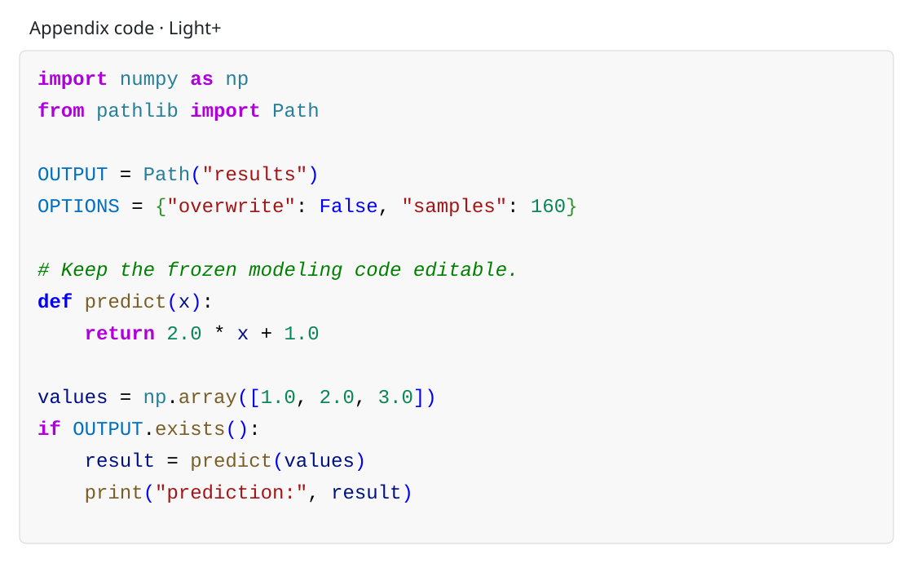

# 附录代码多色语法高亮规范

## 1. 目标与边界

附录关键建模代码默认使用统一的 `code_theme=VS-CODE-LIGHT-PLUS`。按用户提供的浅色代码截图采用 Light+ 语义配色：紫色控制关键字、青色模块/类、棕色函数、深蓝变量、亮蓝命名常量与语言字面量、红色字符串、绿色注释/数字。代码块使用 `#F8F8F8` 极浅灰底，纸张保持白色。下表是输出采用的固定色值；不根据字体抗锯齿或编辑器淡化效果随意改变颜色。

- 代码必须保持为可选择、可复制、可搜索的真实文本；不得用截图、整页图片或不可编辑对象替代。
- 同一篇论文的全部附录代码只使用一个 `code_theme`，同一语义角色始终使用同一字体颜色和字形，不得按代码块随机换色。
- `code_theme` 只控制代码语法高亮，与论文图表的 `palette_set/object_color_map` 相互独立；不得为了匹配图表对象而改变关键字、字符串或注释颜色。
- 颜色只是辅助编码。即使转为灰度或色觉发生变化，仍须能从关键字加粗、注释斜体、引号、缩进、标点和代码结构理解语义。
- 当届官方规则明确要求黑白或禁止彩色时，记录 `code_theme=MONOCHROME_OFFICIAL_OVERRIDE` 与规则证据，改用等宽黑色正文、关键字加粗和注释斜体；官方规则优先。

## 2. `VS-CODE-LIGHT-PLUS` 语义色表

| 语义角色 | 色值 | 字形 | 适用对象 |
|---|---|---|---|
| 普通文本、运算符与标点 | `#000000` | 常规 | 运算符、分隔符及未识别语法 |
| 关键字与控制语句 | `#AF00DB` | 加粗 | `import/from/as/for/if/in/return` 等 |
| 声明关键字、布尔与空值 | `#0000FF` | 关键字加粗，其余常规 | `def/class`、`True/False/None`；不与数值共用颜色 |
| 模块、命名空间与类名 | `#267F99` | 常规 | `os/np/plt/Path` 及类型名；装饰器按实际函数或类角色分类 |
| 函数与方法名 | `#795E26` | 常规 | `addfont/get_name/update/home` 等调用或定义 |
| 变量、参数与属性 | `#001080` | 常规 | 参数、局部变量及对象属性 |
| 命名常量 | `#0070C1` | 常规 | 经语义确认的 `FP/NAME/OUT` 等常量 |
| 字符串与路径字面量 | `#A31515` | 常规 | 引号与字符串内容，包括路径及十六进制字符串 |
| 注释 | `#008000` | 斜体 | 行注释、块注释；文档字符串按实际语义分类 |
| 数值字面量 | `#098658` | 常规 | 整数、小数、科学计数；不包括布尔值和命名常量 |
| 成对圆括号与方括号 | `#0000FF` | 常规 | 具备可靠 token 识别时用于 `()` 与 `[]` |
| 花括号 | `#319331` | 常规 | 具备可靠 token 识别时用于 `{}` |
| 行号 | `#6B7280` | 常规 | 可选行号，低于代码正文的视觉权重 |
| 代码块背景 / 页面 / 边框 | `#F8F8F8` / `#FFFFFF` / `#D1D5DB` | 极浅灰底、白纸、可选细边框 | 不带编辑器界面、色值装饰方块或深色背景 |

代码片段没有某类 token 时，不必为了“颜色齐全”伪造内容。不得按整行轮换颜色、增加彩虹渐变或额外荧光色、下划线装饰和深色编辑器背景。截图里的色值前置小方块、未使用导入的淡化及编辑器辅助线不进入论文；字符串内部即使含 `#0072B2` 等图表色值，也仍按字符串红色显示。

## 3. 字体、字号与分页

- 优先使用 `Consolas`；不可用时按 `Cascadia Mono`、`Source Code Pro`、`Menlo`、`Courier New` 或模板可用的等宽字体顺序回退，并记录实际字体。不得为此临时安装来源不明的字体。
- 字号服从当届模板并以最终 PDF 可读性为准；不得为容纳长代码缩小到不可辨认。
- 保留真实缩进和换行；长行在语义安全位置折行并加续行缩进，不得让代码越出页边界。
- 行号可选。若使用，行号必须连续、低对比且与代码正文分离；跨页后不得重置成造成引用歧义的编号。

## 4. Word 路线

1. 将冻结源代码作为真实文本写入 Word，使用统一的“附录代码”段落样式和等宽字体。
2. 由可信的本地语法分析器、编辑器导出的可编辑富文本，或生成 Word 时的 run 级字体颜色设置完成 token 级高亮；不得粘贴编辑器截图。
3. 清除编辑器界面、文件标签、折叠标记、光标、选择高亮、网页链接和深色背景，只保留代码文本及上述语义色；“附录代码”段落底纹统一为 `#F8F8F8`。
4. 抽查至少三处跨颜色复制：粘贴到纯文本后字符、空格、缩进和换行应与冻结源代码一致。
5. PDF 必须由当前冻结 Word 重新导出，并核对颜色、字形、换行、分页和可复制文本没有变化。

## 5. LaTeX 路线

优先使用 `listings` 与 `xcolor` 实现，不依赖 `minted`、shell escape 或新增的运行时高亮服务。基础样式至少应落实以下映射：

```latex
\definecolor{CodeText}{HTML}{000000}
\definecolor{CodeKeyword}{HTML}{AF00DB}
\definecolor{CodeLiteral}{HTML}{0000FF}
\definecolor{CodeModule}{HTML}{267F99}
\definecolor{CodeFunction}{HTML}{795E26}
\definecolor{CodeClass}{HTML}{267F99}
\definecolor{CodeVariable}{HTML}{001080}
\definecolor{CodeConstant}{HTML}{0070C1}
\definecolor{CodeString}{HTML}{A31515}
\definecolor{CodeComment}{HTML}{008000}
\definecolor{CodeNumber}{HTML}{098658}
\definecolor{CodeBracket}{HTML}{0000FF}
\definecolor{CodeBrace}{HTML}{319331}
\definecolor{CodeLine}{HTML}{6B7280}
\definecolor{CodeBackground}{HTML}{F8F8F8}
\definecolor{CodeBorder}{HTML}{D1D5DB}
\lstdefinestyle{cumcm-appendix-code}{
  basicstyle=\ttfamily\small\color{CodeText},
  identifierstyle=\color{CodeVariable},
  keywordstyle=\color{CodeKeyword}\bfseries,
  keywordstyle=[2]\color{CodeLiteral}\bfseries,
  keywordstyle=[3]\color{CodeLiteral},
  commentstyle=\color{CodeComment}\itshape,
  stringstyle=\color{CodeString},
  numberstyle=\scriptsize\color{CodeLine},
  backgroundcolor=\color{CodeBackground},
  rulecolor=\color{CodeBorder},
  frame=single,breaklines=true,keepspaces=true,
  columns=fullflexible,showstringspaces=false
}
% Apply this language-specific overlay after selecting language=Python.
\lstdefinestyle{cumcm-appendix-python}{
  language=Python,style=cumcm-appendix-code,
  deletekeywords={def,class,True,False,None},
  morekeywords=[2]{def,class},
  morekeywords=[3]{True,False,None}
}
```

`listings` 的 `numberstyle` 只控制行号，不控制源码数值。模块/类名、函数、命名常量、数值及括号颜色须通过可靠的语言 token 配置或经核验的 `emph/emphstyle` 补充；不能可靠识别时保留普通文本色，不得用全局替换染色字符串/注释内部的名称或括号。Python 覆盖样式示范了布尔与空值的独立蓝色映射；MATLAB 按其语言语义配置，不照抄 Python 词表。配置只负责排版，不得改写代码内容。

## 6. 复核清单

- `code_theme` 已记录，全部附录代码使用同一主题；官方黑白例外有规则证据。
- Word 与 PDF 中 token 文本、语义颜色、加粗/斜体、字体、缩进和换行一致。
- 代码可选择、可复制、可搜索；纯文本复制抽查与冻结源代码一致。
- 极浅灰底打印清晰，彩色与灰度预览均能区分代码结构；颜色失效时仍有字形和语法冗余。
- 无截图、深色背景、随机配色、彩虹渐变、编辑器界面、水印、裁切、越界或不可读小字。
- 多色高亮没有改变 `CODE-*` 对应的源代码字符，也没有把非核心辅助代码包装成关键建模代码。

## 7. 配色预览与来源



预览使用独立示例代码，只展示颜色；正式附录必须使用本队冻结的主要建模代码，并保持可编辑文本。该配色按用户截图的视觉要求选定，语义色值参考 [VS Code Light+](https://github.com/microsoft/vscode/blob/main/extensions/theme-defaults/themes/light_plus.json) 与 [Light 基础主题](https://github.com/microsoft/vscode/blob/main/extensions/theme-defaults/themes/light_vs.json)。未复制截图中的个人路径、数据或程序。
