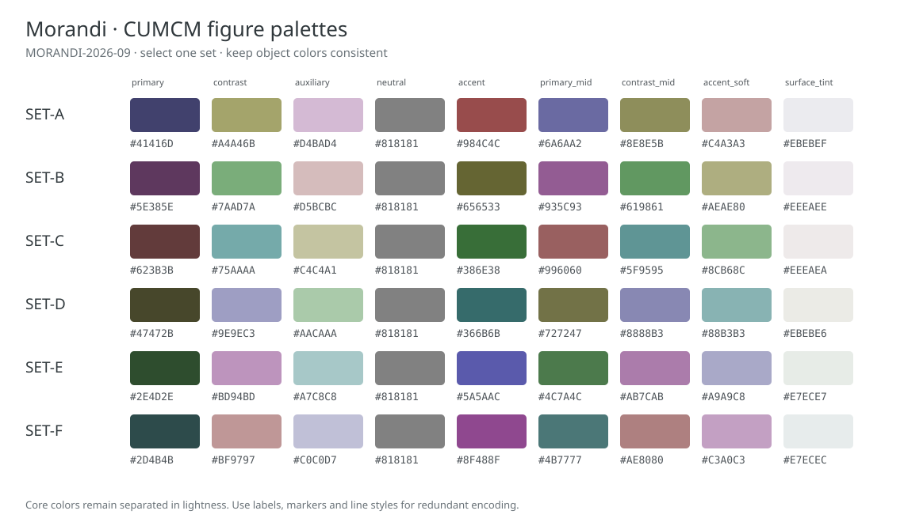

# 图表丰富度与流程图设计

## 设计目标

以莫兰迪色系为主，形成有主次、有层次、可读且能说明问题的图表组合。总览、机理、算法、结果和检验各承担不同任务；丰富度体现在信息覆盖和表达方式。具体图型、数量与复杂度由本题的数据、模型和实际求解过程决定，避免机械配齐图库。

本文为通用设计规则与已确认的配色偏好；不代表已完成 C023 的逐图学习。论文的具体观察、页码与迁移判断分别登记在 [国奖论文图表学习记录](award-figure-studies.md)。

## 先规划整篇论文的图

起草前按实际小问建立图表设计矩阵，每张图记录位置、读者问题、图源数据/模型、主要信息、子图功能、配色角色和生成入口：

| 层次 | 要帮助读者理解什么 | 候选组合 |
|---|---|---|
| 全文总览 | 小问之间的输入、模型、检验与输出关系 | 分问面板或泳道式技术路线图，共享模块只画一次 |
| 数据认识 | 样本组成、分布、相关和异常如何影响建模 | 分布图＋原始点/箱线＋相关热力图等互补子图 |
| 模型解释 | 变量、约束、分层结构或机理如何工作 | 数学结构/几何示意＋关键变量标注＋输入输出接口 |
| 算法说明 | 初始化、迭代、判断、反馈和停止如何发生 | 分层算法流程图、状态转换图或搜索过程局部展开 |
| 结果回答 | 方案、预测、分组或参数选择得到什么 | 主结果图＋分组比较＋重点区域放大 |
| 真实检验 | 误差、稳定性、不确定性与失败边界是什么 | 预测/观测＋残差；敏感性曲线＋区间；收敛曲线＋阈值 |

对每个小问先检查需要哪些信息层次，再选择图。相近指标可用分面矩阵，具有上下游关系的结果可用组合图；每个子图应补充不同信息。共享图例、统一编号、对齐坐标和一致的比较尺度保持整洁。图与正文一起解释，主结果不能只留在图里。

## 较复杂流程图的具体做法

### 选择与过程相符的结构

- 多个小问共享数据与预处理：上方或左侧共享主干，中间按 Q1/Q2/Q3 与实际存在时的 Q4 分组，下方汇总真实交付。
- 同一算法包含多个子系统：按输入、建模、求解、验证设置泳道，跨泳道的箭头标明传递变量或状态。
- 存在迭代优化或反馈：主干保持单一阅读方向，反馈沿外侧返回对应节点，并标注更新条件和停止判据。
- 某一步内部确有复杂结构：总图保留简短模块，旁侧局部展开关键分支；编号和文字明确对应，减少主图拥挤。

### 节点、连线与文字

1. 节点用具体动作和对象命名，例如“构造目标与约束”还应在本题中落实为实际变量/目标；输入和输出标明真实数据、参数或产物。
2. 判断节点有明确条件，分支写出含义；循环给出终止条件。并行、共享、依赖和回流使用一致图例，不用相同无标签箭头混淆语义。
3. 节点宽度、行高、圆角、线宽和对齐方式统一；长文字拆成标题与短说明，公式只保留识别模型所需的核心关系。
4. 主路径视觉权重高于次级说明；次级模块用浅填色和较细边线。留白隔开层次，连接线优先正交，减少交叉和穿过文字。
5. 共用函数、数据或参数用一个共享模块与带标签的接口表达；不重复复制同一模块来扩大图面。
6. 采用适合页面宽度的纵横比例，复杂图过密时拆为总览和局部图，题注解释二者关系；字号以最终排版尺寸为准。
7. 使用可编辑矢量源或可复现的绘图代码，导出 PDF/SVG；图的节点、箭头与正文和冻结模型逐项对应。

总览图 `FIG-OVERVIEW-001` 仍放在问题分析末尾。局部算法图按本问另设 `FIG-Q*-*`，只在实际算法值得展开时使用。美观的流程图可以包含多层分组、泳道、条件分支和细节展开，层次来自真实过程。

## 莫兰迪配色的用法

使用 `palette_family=MORANDI`，从 `SET-A` 至 `SET-F` 显式选择一组，记录 `palette_revision=MORANDI-2026-09` 与 `object_color_map`。两种语言的固定色值见 [图表设计手册](abc-figure-design-playbook.md) 和样式资产。

- 数据主体用主色、对比色或中性参考色；重点色只突出关键模型、推荐解、阈值或输出。
- 流程图使用同系浅底纹组织分组，以深灰文字和连线保证阅读；不把浅色区域填充当作细数据线。
- 相同对象跨统计图、流程图和表格保持映射一致。类别较多时先分组或分面，用线型、标记、直接标签补充颜色。
- 顺序数值和正负偏差采用有明确语义的连续色带，不能用分类颜色循环表示数值大小。科学色带例外须有可读性理由并登记。
- 白色页面保持清晰，慎用大面积装饰背景；文字、细线和误差带必须在最终尺寸及灰度下可辨。
- 配色更新后记录版本，旧冻结稿若要改色需统一重出相关图并重新检查，不能混用不同修订的色值。

代码语法高亮继续使用独立的 `code_theme=VS-CODE-LIGHT-PLUS`；莫兰迪偏好应用于论文图表。

## 制作与复核

先根据设计矩阵绘制结构草图，再绑定真实数据/模型实现，最后在论文实际宽度下查看 Word/PDF。至少核对：

- 总览、局部解释、结果与验证之间形成清楚的阅读顺序，各问没有信息缺口。
- 多子图标题、编号、公共图例、单位和比较尺度一致，重点标注与真实结论相符。
- 流程图箭头和条件明确，主次层次、对齐、留白和分组清晰，无交叉遮挡、裁切或难辨小字。
- 莫兰迪色值、配色版本和对象映射一致；彩色、灰度和色觉缺陷条件下仍可识别主要信息。
- 图源、数据/模型、生成命令与正文同版本；参考论文中的图只用于分析设计方法，正式成稿重新根据本题绘制。
